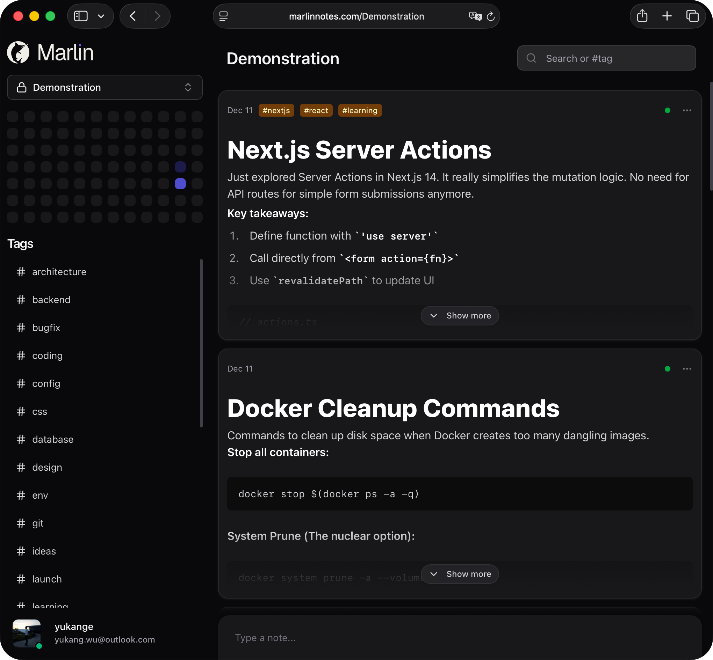
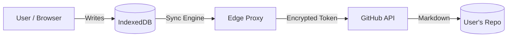

<div align="center">
  <a href="https://marlinnotes.com">
    <!-- 使用文本 Logo，如果有 SVG 可以替换 -->
    
  </a>

  <p>
    <strong>The Local-First, Git-backed note-taking app for developers.</strong>
  </p>

  <p>
    <a href="https://marlinnotes.com"><b>Website</b></a> •
    <a href="#-architecture"><b>Architecture</b></a>
  </p>

  <!-- Badges -->
  <p>
    
    
    
    
  </p>
</div>

<br />

<div align="center">
  
</div>

<br />

## ✨ Introduction

Marlin is a stream-based note-taking tool designed for those who value **speed** and **data ownership**.

Unlike traditional cloud-based apps (Notion, Evernote), Marlin does not store your notes in a proprietary database. Instead, it treats your **GitHub private repository** as the backend.

It leverages **IndexedDB** for instant, offline-capable interactions, and syncs to GitHub in the background.

## 🚀 Features

- **⚡ Zero Latency**: Built on a Local-First architecture. Writing, searching, and navigating happens instantly in the browser.
- **🔒 No Vendor Lock-in**: Your notes are stored as standard Markdown files in *your* GitHub repo.
- **📝 Chat-like Flow**: A frictionless "Stream" interface. Just write, tag, and send.
- **💎 Apple HIG Polish**: A meticulously crafted UI with dark mode, fluid animations, and blur effects.
- **🔌 Offline Ready**: Read and write without an internet connection. Sync happens when you're back online.

## 🛠 Tech Stack

Marlin is built on the modern edge stack:

- **Framework**: [Next.js 15](https://nextjs.org/) (App Router)
- **Runtime**: [Cloudflare Works](https://works.cloudflare.com/) (Edge Runtime)
- **Database (Local)**: [Dexie.js](https://dexie.org/) (IndexedDB Wrapper)
- **Editor**: [Tiptap](https://tiptap.dev/) (Headless & Prosemirror based)
- **Styling**: [Tailwind CSS v4](https://tailwindcss.com/) + [shadcn/ui](https://ui.shadcn.com/)

## 🏗 Architecture

How Marlin handles your data securely:



1.  **Local Write**: Data is written to IndexedDB immediately.
2.  **Background Sync**: The Sync Engine polls for changes or pushes updates.
3.  **Edge Proxy**: To protect client secrets and handle CORS, requests go through a stateless Edge Worker.
4.  **GitHub Storage**: Final data rests in your private repository in a clean structure:

```text
my-marlin-notes/
├── notes/
│   ├── 1734249600000.md  <-- Timestamp ID
│   └── 1734249605000.md
└── README.md
```

## 📄 License

Marlin is distributed under the **Business Source License (BSL) 1.1**.

*   ✅ **Free for Personal Use**: You can copy, modify, and run Marlin for your own personal notes.
*   ✅ **Source Available**: The code is open for auditing and learning.
*   ❌ **Commercial Restriction**: You may **not** use this code to offer a commercial SaaS product that competes with Marlin (i.e., a hosted note-taking service).

The license will automatically convert to **MIT License** (Open Source) on **2029-12-14**.

## 🛡 Security & Privacy

*   **Token Safety**: Marlin never stores your GitHub Access Token in a backend database. It is stored in an encrypted HTTP-only session cookie.
*   **Data Access**: We cannot read your notes. Only your browser and GitHub have access to the raw data.

---

<div align="center">
  <sub>Built by <a href="https://github.com/yukange">@yukange</a>. Crafted for Developers.</sub>
</div>